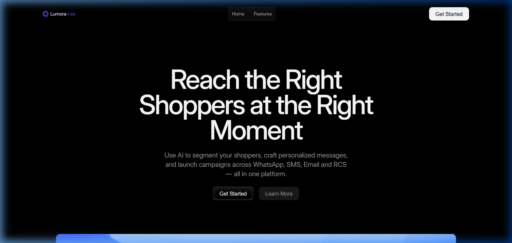
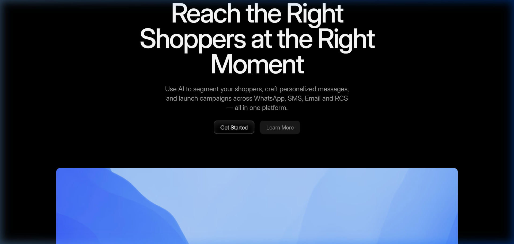
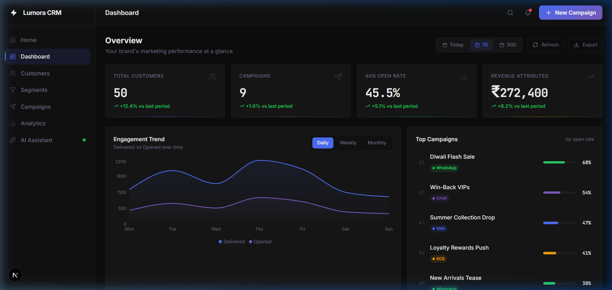
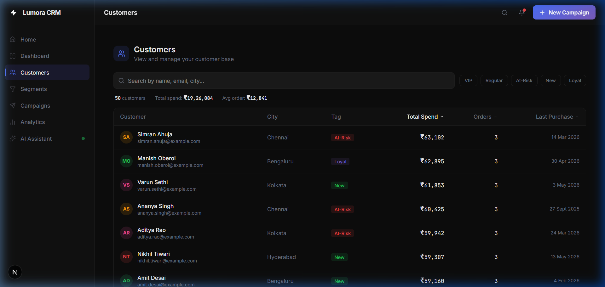
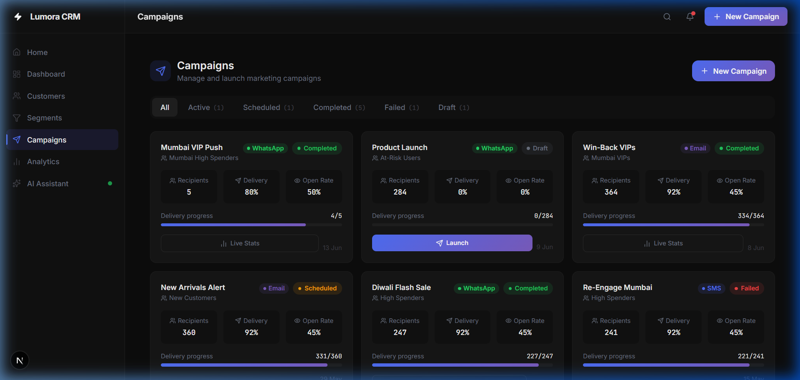
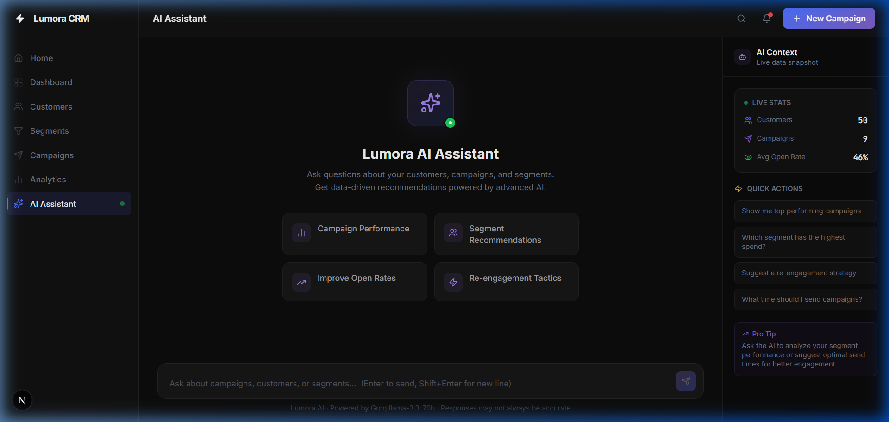
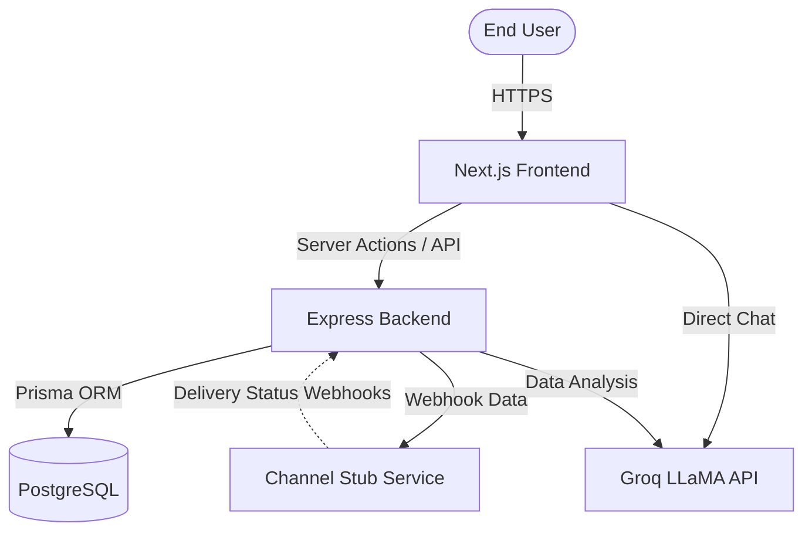

<div align="center">
  
  <h1>Lumora CRM System</h1>
  <p><strong>A Next-Generation AI-Powered Customer Relationship Management Platform</strong></p>
</div>

---

## 📖 Project Overview

Lumora CRM is a full-stack, enterprise-grade Customer Relationship Management system designed for scale. It seamlessly integrates a high-performance **Next.js** frontend with a robust **Express/Prisma** backend.

What sets Lumora apart is its natively integrated **AI Assistant** (powered by LLaMA 3.3 70B via Groq), which allows users to instantly analyze campaigns, generate segment queries, and draft multi-channel communication directly from the dashboard.

<div align="center">
  
</div>

## ✨ Features

- **Dynamic Landing Page**: Beautiful, highly-converted Framer-designed landing site perfectly integrated with the React ecosystem.
- **AI-Powered Insights**: Talk directly to your data. Ask the AI to build segments or analyze campaign CTRs via natural language.
- **Advanced Campaign Management**: Omni-channel outreach (Email, SMS, WhatsApp) built on a scalable Channel Stub integration.
- **Customer Segmentation**: Filter users with complex logic rules and sync them seamlessly to campaigns.
- **Interactive Dashboard**: Real-time revenue tracking, order history mapping, and detailed customer analytics.

## 📸 Screenshots

| Dashboard | Customers |
| :---: | :---: |
|  |  |

| Campaigns | AI Assistant |
| :---: | :---: |
|  |  |

## 🏗 Architecture Diagram



*For more in-depth architectural details, see [ARCHITECTURE.md](./ARCHITECTURE.md)*

## 🚀 Setup Instructions

### Prerequisites
- Node.js (v18+)
- PostgreSQL Database
- Groq API Key (for the AI Assistant)

### 1. Database Setup
Ensure you have PostgreSQL running. Run the following in the `/backend` directory:
```bash
npm install
npx prisma generate
npx prisma db push
npx prisma db seed # Installs 50 dummy customers, 150 orders, and 8 campaigns
```

### 2. Backend Startup
Create a `.env` file in the `/backend` directory with your `DATABASE_URL` and `GROQ_API_KEY`.
```bash
npm run dev
```
*Backend runs on port 5000.*

### 3. Frontend Startup
Create a `.env.local` file in the `/frontend` directory containing `NEXT_PUBLIC_API_URL=http://localhost:5000`.
```bash
npm install
npm run dev
```
*Frontend runs on port 3000.*

## 🌍 Deployment

### Vercel Deployment (Frontend)
1. Fork or clone this repository to your GitHub account.
2. In Vercel, import the project.
3. Set the **Root Directory** to `frontend`.
4. Ensure the Build Command is `npm run build`.
5. Deploy!

### Backend Deployment (Render / Heroku / AWS)
1. Point your PaaS to the `backend` directory.
2. Provide your `DATABASE_URL` as a production environment variable.
3. Use `npm start` (mapped to `ts-node src/index.ts` or a compiled `dist` script).

## 🔗 Links
- **Deployment URL:** [Add your Vercel URL here]
- **Demo Video URL:** [Add your YouTube/Loom URL here]
